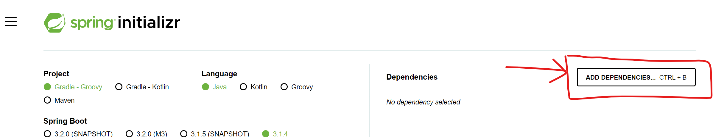
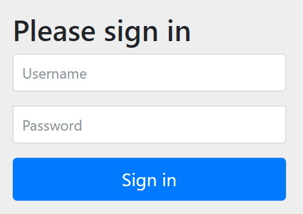

# Spring Boot 3 Quick Start

## Environment Setup
 - You should have the following installed:
     - JDK
     - Java IDE (eg. IntelliJ)

## 5. Spring Boot Overview
 - Building traditional Spring application is really HARD. Some questions are:
     - Which JAR dependencies do I need?
     - How do I set up coonfiguration (xml or java)?
     - How do I install the server? (Tomcat, JBoss.etc)

 - Why use Spring Boot?
     - Make it easier to get started with Spring Development
     - Minimize the amount of manual configuration
         - perform auto-configuration based on props files and JAR classpath
     - Helps to resolve dependency conflicts (Maven or Gradle)
     - Provide an embedded HTTP Server so you can get started quickly

 - Spring Boot and Spring
     - Spring Boot uses Spring behind the scenes

 - Spring Initializr
     - Quickly start Spring Boot project
     - http://start.spring.io

 - Spring Boot Embedded Server
     - Provides an embedded HTTP server, so you can start quickly
     - No need to install server separately
    
 - running Spring Boot Apps
     - run as standalone
     - run the spring boot app from IDE or CLI
     - run as WAR to an external server
     - 

## 6. Spring Boot Initializr
 - http://start.spring.io 

 - Maven
    - Tell Maven the projects you are working with (dependencies).
    - Maven will go out and download the JAR files for those projects for you

 - Development Process
1. Configure project at Spring Initializr Website (http://start.spring.io)


2. Download the zip; unzip
3. Import into Java IDE
    
4. Run Spring App


Incase you face some issues, can try adding snakeyaml@2.0 to dependencies

```xml
<dependency>
    <groupId>org.yaml</groupId>
    <artifactId>snakeyaml</artifactId>
    <version>2.0</version>
</dependency>
```


You will find one of the log message to be:
```
2023-09-30T21:33:59.475+08:00  INFO 106148 --- [           main] o.s.b.w.embedded.tomcat.TomcatWebServer  : Tomcat started on port(s): 8080 (http) with context path ''
```

If you head over to localhost:8080, you'll realize that the server does exist.

## 7. Spring Boot - Rest Controller
 - Create Package "rest", and within it a class "FunRestController"
 ```java
 @RestController
public class FunRestController {
    // expose "/" that return "Hello World"
    @GetMapping("/")
    public String sayHello() {
        return "Hello World";
    }
}
```
 - Open localhost:8080 to find "Hello World"

## 8. Spring Framework Overview

 - Goal of Spring
     - Lightweight development with Java POJOs (Plain-Old-Java-Objects)
     - Dependency Injection to promote loose coupling
     - Minimize boilerplate Java code

 - Key Concepts
    - Core Framework (bean lifecycle/management)
    - Infrastructure (AOP)
    - Data Access Layer (DAL: JDBC, orm, Hibernate)
    - Web Layer (Servlet, WebSocket, Web)
    - Test Layer (Unit, Mock, Integration)

## 11. What is Maven?
 - Project Management Tool
 - Without Maven, developer will need to download each dependency jar one by one

 - Standard Directory Structure

|  Directory   | Description  |
|  ----  | ----  |
| src/main/java  | Your Java source code |
| src/main/resources  | Property/config files used by your app |
| src/main/webapp  | JSP files and web config files; other web assets (images, css, js, etc) |
| src/test  | Unit testing code and properties |
| target  | destination directory for compiled code. Automatically created by Maven |


 - Maven Key Concepts
     - pom.xml (Project Object Model)
         - configuration file for your project ('shopping cart' for Maven)
     - File Structure
         - 1. Project Meta Data (Project name, verion, output file (JAR, WAR).etc)


|  Name   | Description  |
|  ----  | ----  |
| Group ID  | Name of company/group/organization; convention: com.luv2code |
| Artifact ID  | Name for this project: mycoolapp |
| Version (optional, but highly recommend to include) |  |

```xml
<groupId>com.marsCoder.springboot.demo</groupId>
<artifactId>mycoolapp</artifactId>
<version>0.0.1-SNAPSHOT</version>
<name>mycoolapp</name>
<description>Demo project for Spring Boot</description>
<properties>
    <java.version>17</java.version>
</properties>
```


 - 
     - 
         - 
            2. Dependencies
            3. Plug-ins (Additional custom tasks to run: generate JUnit test reports.etc)


 - How to find Dependencies?
     - http://search.maven.org

## 14. Spring Boot Project Files

 - Maven Wrapper Files
     - mvnw allows you to run a maven project
     - mvnw.cmd is for windows
     - mvnw.sh is for linux

 - Application Properties
     - By default, Spring Boot will load properties from src/main/resources/application.properties
     - this is empty at the beginning
     - can add spring boot or your own properties, such as:
```xml
# Spring boot properties
server.port=8585

# Your own custom properties
coach.name=Mickey Mouse
```

 - 
     - Once we do this, we can use annotations to define variables.
```xml
@Value("${coach.name}")
private String coachName;
```

 - Static Content
     - located in src/main/resources/static
     - By default, spring boot will load static resources from /static directory
     - Examples: HTML files, css, javascript, images.etc

 - WARNING: DO NOT USE src/main/webapp directory, unless you are exporting it as WAR

 - Templates
     - Spring Boot includes auto-configuration for following template engines:
         - FreeMarker
         - ThymeLeaf
         - Mustache

     - Spring will load templates from "/templates" directory


## 16. Spring Boot Starters

 - What is spring boot starters?
     - a curated list of Maven Dependencies
     - a collection of dependencies grouped together
     - tested and verified by the Spring Development team
     - Makes it much easier for the developer to get started with Spring
     - Reduces the amount of Maven configuration

 - Example: spring-boot-starter-web
     - contains spring-web, spring-webmvc, hibernate-validator, json, tomcat.etc    

```xml
<dependency>
    <groupId>org.springframework.boot</groupId>
    <artifactId>spring-boot-starter-web</artifactId>
</dependency>
```

 - When you are creating a starter initializr, you can add dependency here.
 

|  Name   | Description  |
|  ----  | ----  |
| spring-boot-starter-web  | Build web apps, including validation, REST. Uses Tomcat as default embedded server |
| spring-boot-starter-security  | Adding Spring Security support |
| spring-boot-starter-data-jpa | Spring Database support with JPA and Hibernate |
| spring-boot-starter-thymeleaf |  |

 -  
     - For more info on starters, visit https://docs.spring.io/spring-boot/docs/current/reference/htmlsingle/#using.build-systems.starters


 - how do you know what is in the starters?
     - Most IDEs have a Dependency Management/View Feature

## 17. Spring Boot Starter Parent

 - Spring Boot provides a "starter parent"
 - This is a special starter that provides Maven defaults
```xml
<parent>
    <groupId>org.springframework.boot</groupId>
    <artifactId>spring-boot-starter-parent</artifactId>
    <version>3.1.4</version>
    <relativePath/> <!-- lookup parent from repository -->
</parent>
```

 - includes Default compiler level, UTF-8 source encoding.etc.
     - To override a default, set as a property
```xml
<properties>
    <java.version>17</java.version>
</properties>
```

 - All spring-starter-* doesn't have version. This is because it inherits from starter parent


## 18. Spring Boot Dev Tools

 - spring-boot-dev-tools
     - automatically restarts your application when your code is updated
     - no need to add additional code, just add dependecy to pom.xml
     - IntelliJ Community Edition doesn't support DevTools by default
         -  Preferences > Build, Exection, Deployment > Compiler
             - check box: Build project automatically
         - Preferences > Advanced settings
             - check box: allow auto-make to ...

 - Development Process
     - 1. Apply IntelliJ Configurations
     - 2. Edit pom.xml and add spring-boot-devtools
     - 3. Add new REST endpoint to our app
     - 4. Verify the app is automatically updated

## 17. Spring Boot Actuators
 - What does Spring Boot Actuators do?
     - Exposes endpoints to monitor and manage your application
     - actuator-related REST endpoints are automatically added to your application (no additional code required)

 - Adding dependency to your POM
```xml
<dependency>
    <groupId>org.springframework.boot</groupId>
    <artifactId>spring-boot-starter-actuator</artifactId>
</dependency>
```

 - Endpoints are prefixed "/actuator"
     - "/actuator/health": checks health information about your application
         - if you go to localhost:8080/actuator/health, you'll get the status information (whether it's up or not)
         - by default, only this endpoint is exposed
     - "/actuator/info": checks info about app
         - To enable this endpoint, you need to set properties (src/main/resources/application.properties)
```
management.endpoints.web.exposure.include=health,info
management.info.env.enabled=true

# To expose ALL endpoints, you can do:
# management.endpoints.web.exposure.include=*
```

 -  
     -
         - Even if you go to localhost:8080/actuator/info now, you'll get a "{}" (which is not useful)
         - you'll need to add info.XXX properties to set what you want to show

```
# Example
info.app.name=My Super Cool App
info.app.description=A crazy and fun application
info.app.version=1.0.0
```

 - Other autuator endpoints

|  Name   | Description  |
|  ----  | ----  |
| /auditevents  | Audit events for your application |
| /beans  | List of all beans registered in the Spring application context |
| /mappings  | List of all @RequestMapping paths |

 - For more details, go to https://docs.spring.io/spring-boot/docs/current/reference/htmlsingle/#production-ready-endpoints

 - Development Process
     - 1. Edit pom.xml and add spring-boot-starter-actuator
     - 2. view actuator endpoints for: /health
     - 3. Edit application.properties to customize /info

## 18. Spring Boot Actuator - Securing Endpoints
 - You may NOT want expose all of the actuator endpoint information
 - Simply add Spring Security to project and endpoints are secured

```xml
<dependency>
    <groupId>org.springframework.boot</groupId>
    <artifactId>spring-boot-starter-security</artifactId>
</dependency>
```

 - Now, when you access /actuator/beans, you'll prompted to login



 - 
     - Default Username is "user"
     - Password is printed in the logs

```
2023-10-01T01:07:50.350+08:00  WARN 125768 --- [           main] .s.s.UserDetailsServiceAutoConfiguration : 

Using generated security password: d39115a2-ebff-469b-8c9e-ef6a93f97ef2

This generated password is for development use only. Your security configuration must be updated before running your application in production.
```

 - You can override by changing properties


## 25. Run Spring Boot apps from the command line

 - Since we are using Spring Boot, the server is embedded in the JAR
 - two options:
     - option 1: use `java -jar XXX.jar`
     - option 2: use spring boot maven plugin
         - `./mvnw package; ./mvnw spring-boot:run`


 - Development Process
     - 1. Exit the IDE
     - 2. Package the app using `mvnw package`
     - 3a. (option A) Run app using `java -jar`
     - 3b. (option B) Run app using Spring Boot Maven plugin, `mvnw spring-boot:run`

## 27. Injecting Custom Application Properties

 - By default, Spring Boot reads information from a standard property file (application.properties)
 - You can define ANY custom property in this file
     - Your Spring Boot app can access properties using `@Value`

 - Development Process
     - 1. Define custom properties in application.properties
```
# in application.properties
coach.name=Micky Mouse
team.name=The Mouse Club
```
 - 
     - 2. Inject properties into Spring Boot application using `@Value`

```java
import org.springframework.beans.factory.annotation.Value;
...

@RestController
public class FunRestController {
    // Inject properties for coach.name and team.name
    @Value("${coach.name}")
    private String coachName;
    @Value("${team.name}")
    private String teamName;

    ...
}

```

## 29. Configuring the Spring Boot Server

 - Spring Boot can be configured in the `application.properties` file
     - including areas of server port, context path.etc
 - For more details, go to https://docs.spring.io/spring-boot/docs/current/reference/html/application-properties.html#appendix.application-properties

  - Core Properties
```
# Log Levels severity mapping
logging.level.org.springframework=DEBUG
logging.level.org.hibernate=TRACE

# Log filename
logging.file.name=my-crazy-stuff.log
logging.file.path=c:/myapps/demo
```

 - Web Properties
```
# HTTP server port
server.port=7070

# Context path of the application
server.servlet.context-path=/my-silly-app

# The above config will change the path to localhost:7070/my-silly-app

# Default HTTP session timeout
server.servlet.session.timeout=15m
```

 - Actuator Properties
 - Security Properties
```
# Default user name
spring.security.user.name=admin

# Password for default user
spring.security.user.password=topsecret
```

- Data Properties
```
# JDBC url of the database
spring.datasource.url=jdbc:mysql://localhost:3306/ecommerce

# Login username of the database
spring.datasource.username=scott

# Login password of the database
spring.datasource.password=tiger
```

