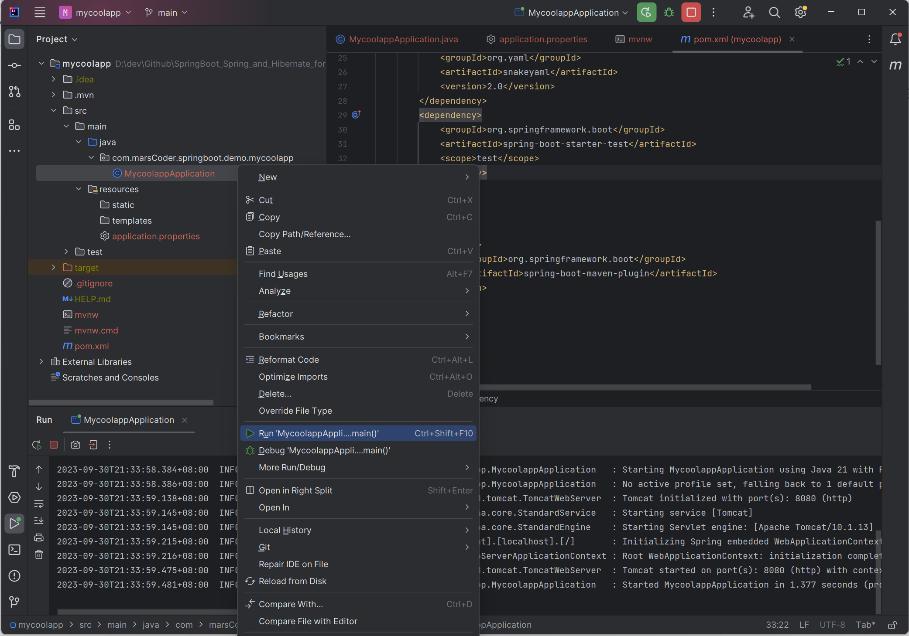

# Spring Boot 3 Quick Start

## Environment Setup
 - You should have the following installed:
     - JDK
     - Java IDE (eg. IntelliJ)

## 5. Spring Boot Overview
 - Building traditional Spring application is really HARD. Some questions are:
     - Which JAR dependencies do I need?
     - How do I set up coonfiguration (xml or java)?
     - How do I install the server? (Tomcat, JBoss.etc)

 - Why use Spring Boot?
     - Make it easier to get started with Spring Development
     - Minimize the amount of manual configuration
         - perform auto-configuration based on props files and JAR classpath
     - Helps to resolve dependency conflicts (Maven or Gradle)
     - Provide an embedded HTTP Server so you can get started quickly

 - Spring Boot and Spring
     - Spring Boot uses Spring behind the scenes

 - Spring Initializr
     - Quickly start Spring Boot project
     - http://start.spring.io

 - Spring Boot Embedded Server
     - Provides an embedded HTTP server, so you can start quickly
     - No need to install server separately
    
 - running Spring Boot Apps
     - run as standalone
     - run the spring boot app from IDE or CLI
     - run as WAR to an external server
     - 

## 6. Spring Boot Initializr
 - http://start.spring.io 

 - Maven
    - Tell Maven the projects you are working with (dependencies).
    - Maven will go out and download the JAR files for those projects for you

 - Development Process
1. Configure project at Spring Initializr Website (http://start.spring.io)


2. Download the zip; unzip
3. Import into Java IDE
    
4. Run Spring App



Incase you face some issues, can try adding snakeyaml@2.0 to dependencies

```xml
<dependency>
    <groupId>org.yaml</groupId>
    <artifactId>snakeyaml</artifactId>
    <version>2.0</version>
</dependency>
```


You will find one of the log message to be:
```
2023-09-30T21:33:59.475+08:00  INFO 106148 --- [           main] o.s.b.w.embedded.tomcat.TomcatWebServer  : Tomcat started on port(s): 8080 (http) with context path ''
```

If you head over to localhost:8080, you'll realize that the server does exist.

## 7. Spring Boot - Rest Controller
 - Create Package "rest", and within it a class "FunRestController"
 ```java
 @RestController
public class FunRestController {
    // expose "/" that return "Hello World"
    @GetMapping("/")
    public String sayHello() {
        return "Hello World";
    }
}
```
 - Open localhost:8080 to find "Hello World"

## 8. Spring Framework Overview

 - Goal of Spring
     - Lightweight development with Java POJOs (Plain-Old-Java-Objects)
     - Dependency Injection to promote loose coupling
     - Minimize boilerplate Java code

 - Key Concepts
    - Core Framework (bean lifecycle/management)
    - Infrastructure (AOP)
    - Data Access Layer (DAL: JDBC, orm, Hibernate)
    - Web Layer (Servlet, WebSocket, Web)
    - Test Layer (Unit, Mock, Integration)

## 11. What is Maven?
 - Project Management Tool
 - Without Maven, developer will need to download each dependency jar one by one

 - Standard Directory Structure

|  Directory   | Description  |
|  ----  | ----  |
| src/main/java  | Your Java source code |
| src/main/resources  | Property/config files used by your app |
| src/main/webapp  | JSP files and web config files; other web assets (images, css, js, etc) |
| src/test  | Unit testing code and properties |
| target  | destination directory for compiled code. Automatically created by Maven |


 - Maven Key Concepts
     - pom.xml (Project Object Model)
         - configuration file for your project ('shopping cart' for Maven)
     - File Structure
         - 1. Project Meta Data (Project name, verion, output file (JAR, WAR).etc)


|  Name   | Description  |
|  ----  | ----  |
| Group ID  | Name of company/group/organization; convention: com.luv2code |
| Artifact ID  | Name for this project: mycoolapp |
| Version (optional, but highly recommend to include) |  |

```xml
<groupId>com.marsCoder.springboot.demo</groupId>
<artifactId>mycoolapp</artifactId>
<version>0.0.1-SNAPSHOT</version>
<name>mycoolapp</name>
<description>Demo project for Spring Boot</description>
<properties>
    <java.version>17</java.version>
</properties>
```


 - 
     - 
         - 
            2. Dependencies
            3. Plug-ins (Additional custom tasks to run: generate JUnit test reports.etc)


 - How to find Dependencies?
     - http://search.maven.org

