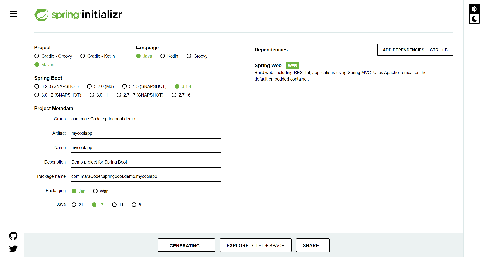

# Spring Boot 3 Quick Start

## Environment Setup
 - You should have the following installed:
     - JDK
     - Java IDE (eg. IntelliJ)

## 5. Spring Boot Overview
 - Building traditional Spring application is really HARD. Some questions are:
     - Which JAR dependencies do I need?
     - How do I set up coonfiguration (xml or java)?
     - How do I install the server? (Tomcat, JBoss.etc)

 - Why use Spring Boot?
     - Make it easier to get started with Spring Development
     - Minimize the amount of manual configuration
         - perform auto-configuration based on props files and JAR classpath
     - Helps to resolve dependency conflicts (Maven or Gradle)
     - Provide an embedded HTTP Server so you can get started quickly

 - Spring Boot and Spring
     - Spring Boot uses Spring behind the scenes

 - Spring Initializr
     - Quickly start Spring Boot project
     - http://start.spring.io

 - Spring Boot Embedded Server
     - Provides an embedded HTTP server, so you can start quickly
     - No need to install server separately
    
 - running Spring Boot Apps
     - run as standalone
     - run the spring boot app from IDE or CLI
     - run as WAR to an external server
     - 

## 6. Spring Boot Initializr
 - http://start.spring.io 

 - Maven
    - Tell Maven the projects you are working with (dependencies).
    - Maven will go out and download the JAR files for those projects for you

 - Development Process
1. Configure project at Spring Initializr Website (http://start.spring.io)



2. Download the zip; unzip
3. Import into Java IDE
    
4. Run Spring App


Incase you face some issues, can try adding snakeyaml@2.0 to dependencies

```xml
<dependency>
    <groupId>org.yaml</groupId>
    <artifactId>snakeyaml</artifactId>
    <version>2.0</version>
</dependency>

```

