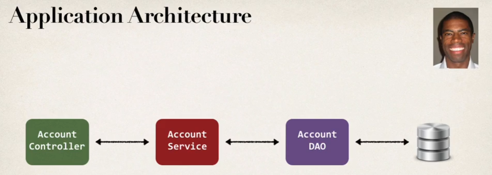
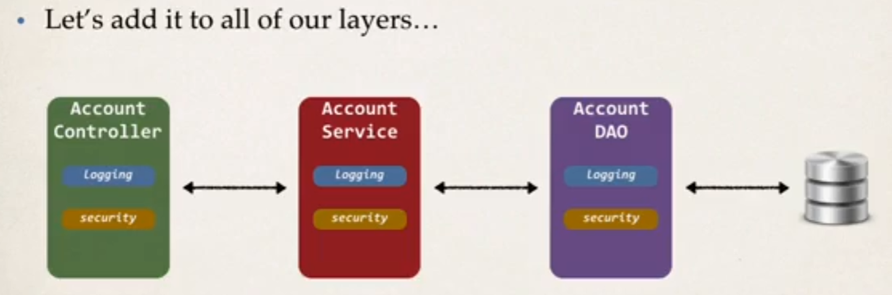
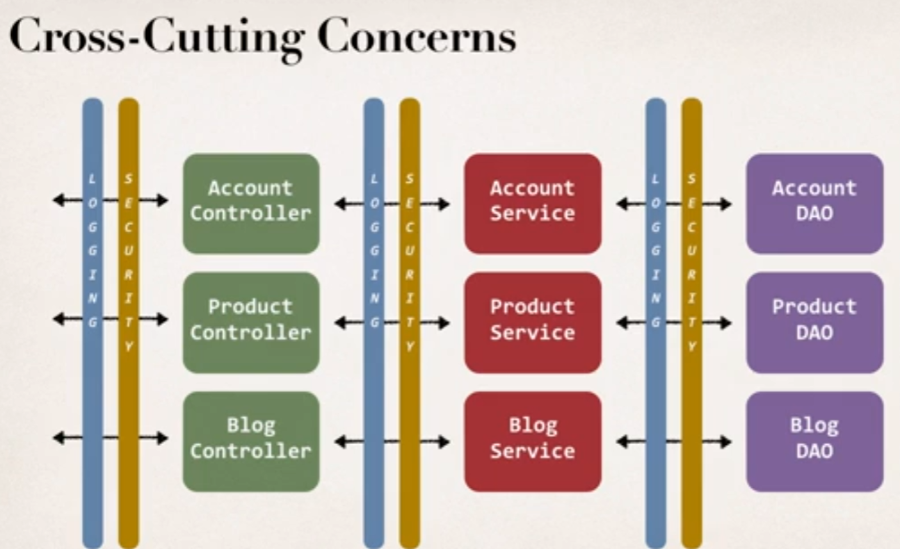

# Aspect Oriented Programming (AOP)

## Application Architecture

Assume we start with this:



## The problem AOP is trying to solve

* Assume we have many DAO methods like the one below:

```java
public void addAccount(Account theAccount, String userID) {
    entityManager.persist(theAccount);  // Basic JPA/Hibernate code to save an entity
}
```

* Let's say we have a new requirement to add logging, add security to **all** DAO methods (before the start of the method) and **all** microservices



* You will realize that there are 2 main problems now:
    * 1. Code Tangling
        * For a given method, addAccount, we have logging and security code tangled in
    * 2. Code Scattering
        * If we need to change logging or security code, we have to update ALL classes

* Other possible solutions?
    * Inheritance
        * Every class would inherit from a base class
        * However, you can't have multiple inheritances

    * Delegation
        * Classes could delegate logging, security calls
        * Still, would need to update classes if we wanted to   
            * Add/Remove logging or security
            * Add new feature like auditing, API management, instrumentation

* Solution: AOP
    * Aspect encapsulates "cross-cutting" logic
        * cross-cutting concerns (concerns=logic, in this context)
        * What is cross-cutting concerns?



*
    * Benefits of AOP
        * Code for Aspect is defined in a single class
            * Much better than being scattered everywhere
            * Promotes code reuse and easier to change
        * Business Code in your application is cleaner
            * Only applies to business functionality: addAccount
            * Reduces code complexity
        * Configurable
            * Based on configuration, apply Aspects selectively to different parts of app
            * No need to make change to main application code... very important
    
    * Common AOP use case
        * Logging, Security, Transactions
        * Audit Logging
            * who, what, when, where
        * Exception Handling
            * log exception and notify DevOps team via SMS/email
        * API Management
            * how many times has a method been called user
            * analytics: what are peak times? what is average load? who is top user?

    * Advantages
        * Reusable modules
        * Resolve code tangling
        * Resolve code scatter
        * Applied selectively based on configuration
    * Disadvantages
        * Too many aspects and app flow is hard to follow
        * Minor performance cost for aspect execution (run-time weaving)

* Terminology
    * Aspect
        * module of code for a cross-cutting concern (logging, security)
    * Advice
        * What action is taken and when it should be applied?
        * types
            * Before advice: run before the method
            * After Finally advice: run after the method (finally)
            * After returning advice: run after the method (success execution)
            * After throwing advice: run after method (if exception thrown)
            * Around advice: run before and after method
    * Join Point
        * when to apply code during program execution
    * Pointcut
        * A predicate expression for where advice should be applied
    * Weaving
        * Connecting aspects to target objects to create an advised object
            * Different types of weaving
                * compile-time
                * load-time
                * run-time
        * Regarding performance: run-time weaving is the slowest

# Two Leading frameworks: Spring AOP and AspectJ
* Spring AOP
    * Spring provided
    * uses run-time weaving of aspects
* AspectJ 
    * original AOP framework, released in 2001
    * Provides complete support for AOP
    * Rich support for
        * join-points: method-level, constructor, field
        * code weaving: compile-time, post-compile-time, load-time