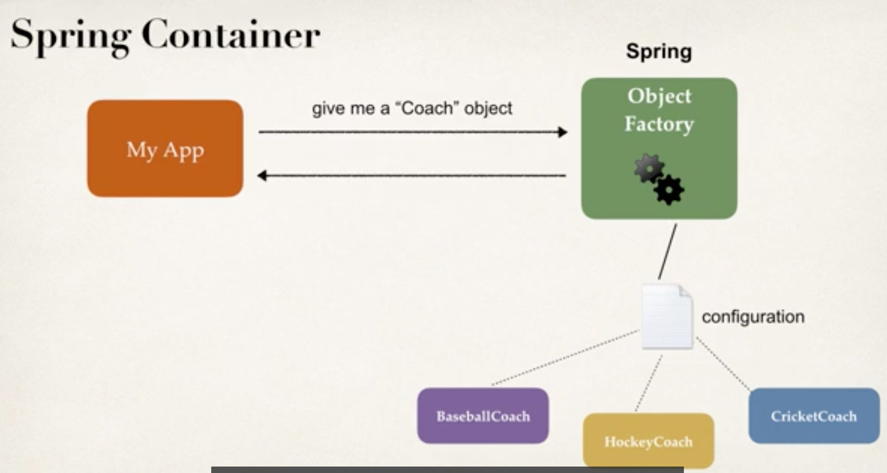
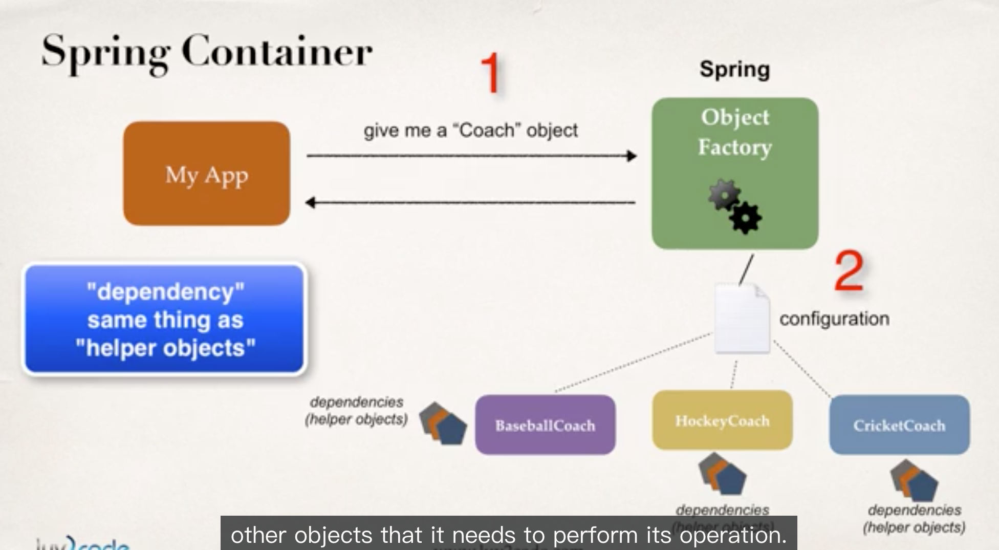

# Spring Core

## Inversion of Control?

 * Below is an ideal solution

* The "Object Factory" is a spring container, and it's responsible for:
    * Create and Manage Objects (Inversion of Control)
    * Inject Object's dependencies (Dependency Injection)

* IOC Definition
    * The approach of **outsourcing the construction** and **management of objects**
    * outsource to an object factory

* Basically, use Spring Object Factory to create corresponding object
* Methods
    * XML configuration file (legacy + not recommended, but most legacy apps still use this)
    * Java Annotations (modern)
    * Java Source Code (modern)

## Dependency Injection

* Dependency Inversion Principle
    * The client delegates calls to another object the responsibility of providing its dependencies.

* Current Situation
    * Our Coach already provides daily workouts
    * Now, will also provide daily fortunes
        * New helper: FortuneService
        * This is a dependency

* Injection Types
    * Constructor Injection
        * Use this when you have **required** dependenecies (General recommended)
    * Setter Injection
        * use this when you have **optional** dependencies
