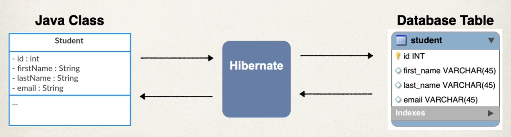
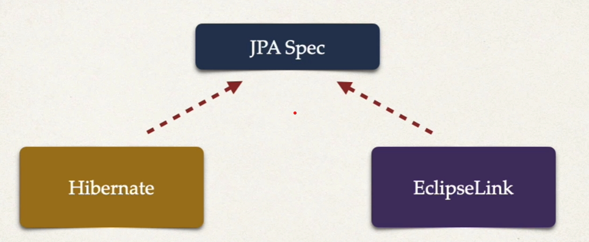
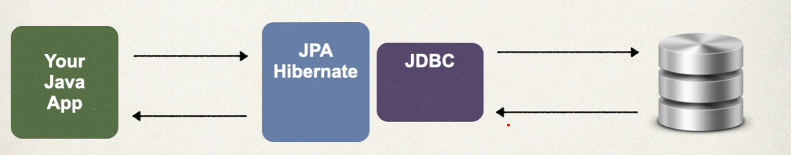

# Hibernates/JPA CRUD

## What is Hibernate?
    * A framework for persisting/saving Java objects in a database
    * https://hibernate.org/orm/
    


* Benefits
    * Hibernates handles all the low-level SQL
    * Minimizes the amount of JDBC code you have to develop
    * Hibernate provides the Object-to-relational mapping (ORM)

* Object-to-relational Mapping
    * mapping between java class and database schema



## What is JPA?
* Jakarta Persistence API (previously known as Java Persistence API)

* vendor implementations
    * Hibernate
    * EclipseLink




* Benefits
    * By having a standard API, you are not locked to vendor's implementation
    * Maintain portable, flexible code by coding the JPA spec
    * Can theoretically switch vendor implementation (eg. switch between Hibernate and EclipseLink)

* Saving a Java Object with JPA
```java
Student student = new Student("Paul", "Doe", "pd@pd.com");

// save it to database
entityManager.persist(theStudennt); // entityManager is a JPA Helper Object
```

* Retrieving a Java Object with JPA

```java
Student student = new Student("Paul", "Doe", "pd@pd.com");
entityManager.persist(theStudennt);

// Retrieve from the database
int theID = 1;
Student myStudent = entityManager.find(Student.class, theID);
```

* Querying for Java Objects

```java
TypedQuery<Student> theQuery = entityManager.createQuery("from Student", Student.class);
List<Student> students = theQuery.getResultList();  // Returns a list of Student objects from the database.
```

## Relationship between JDBC and JPA
* Hibernate/JPA uses JDBC for all database communications



