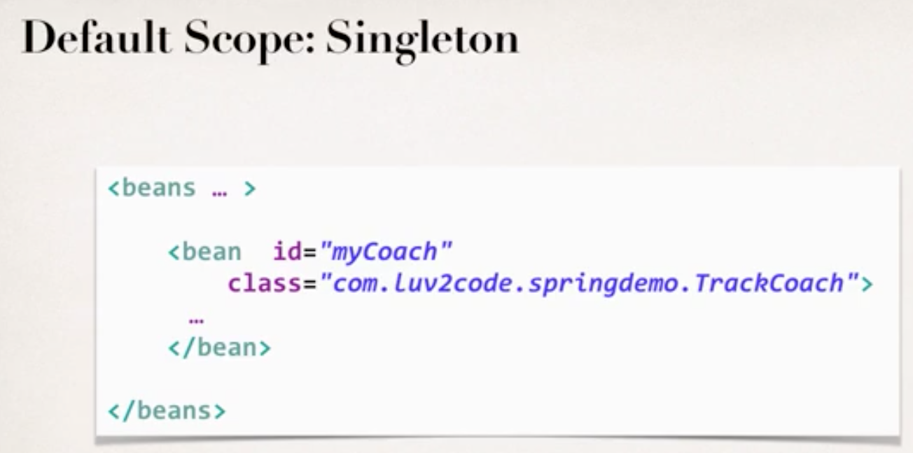
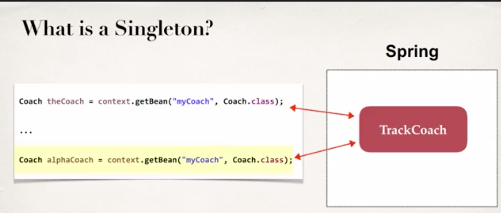
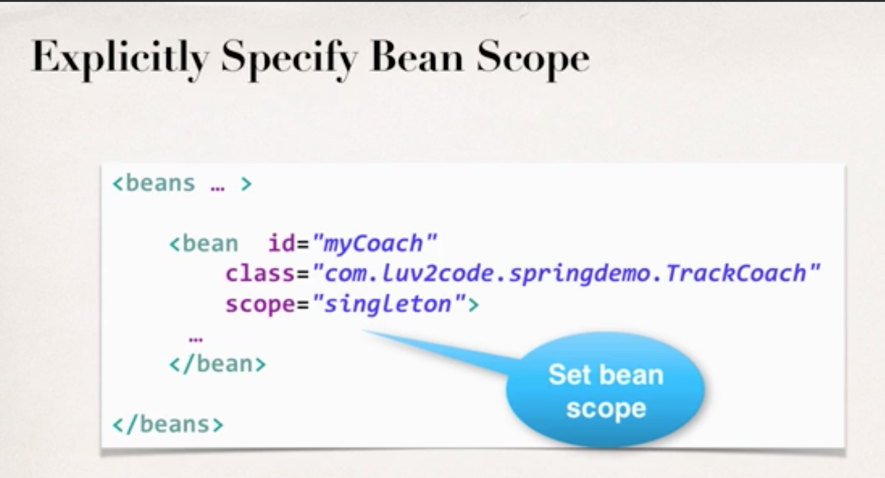
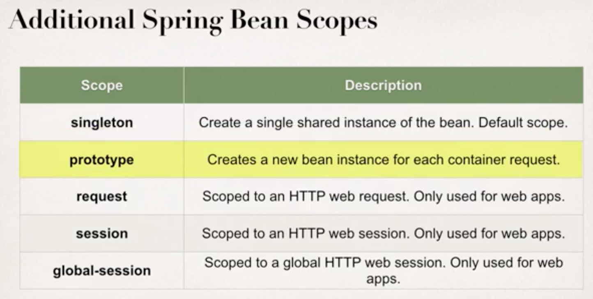
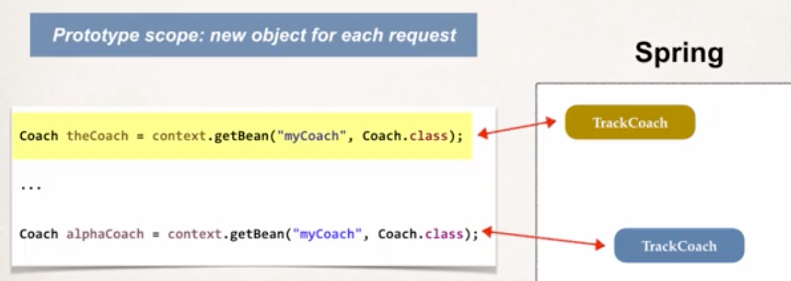
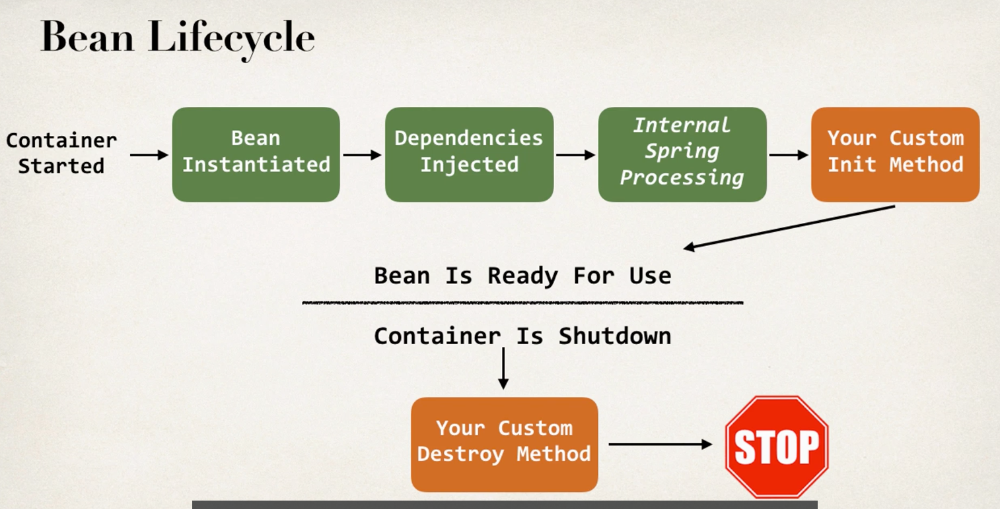
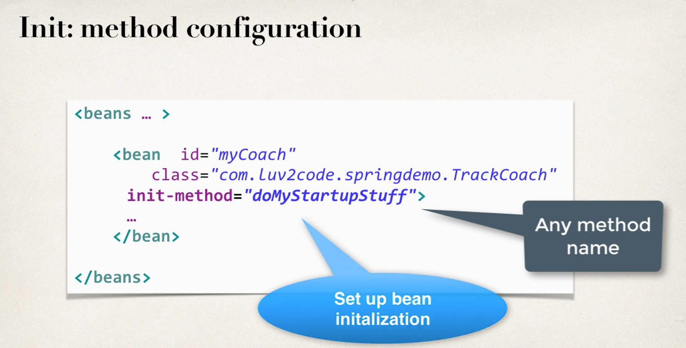

# 1. Bean Scopes

* Scope refers to the lifecycle of a bean
    * how long does the bean live?
    * how many instances are created?
    * how is the bean shared?

* Default scope of a bean is **singleton**

* What is a singleton?
    * Spring Container creates only one instance of the bean, by default.
    * it is cached in memory
    * all requests for the bean will return a SHARED refernece to the SAME bean

* Additional Spring Bean Scopes

* Prototype Scope
    * new object for each request

# 2. Bean Lifecycle

## 2.1 Bean Lifecycle Methods / Hooks
* You can add custom code during **bean initialization**
    * Calling custom business logic methods
    * Setting up handles to resources (db, sockets, file.etc)

* You can also add custom code during **bean destruction**
    * Calling custom business logic methods
    * Clean up handles to resources (db, sockets, file.etc)

### 2.1.1 Development Process

1. Define your methods for init and destroy
2. Configure the method names in Spring config file