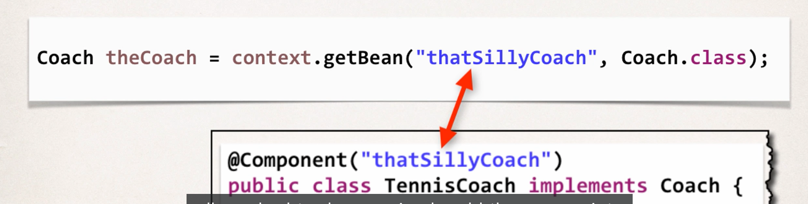
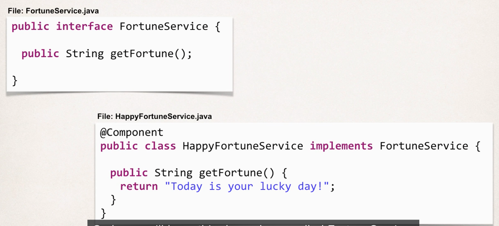

# 1. What are Java Annotations?

* Definition
    * Special labels/markers added to Java Classes
    * Provide meta-data about the class
    * processed at compile time or run-tiem for special processing

* Example

* Why Spring configurations with Annotations?
    * XML configurations can be verbose
    * Solution: Configure your spring beans with annotations - to minimize XML configurations

* Scanning for Component Classes
    * Spring will scan your Java class for special annotations
    * Automatically register the beans in the Spring container

## 1.1 Deveopment Process

1. Enable component scanning in Spring Config file

2. Add the @Component Annotation to your Java Classes

3. Retrieve bean from Spring container
(same as before)

2. Default Component Names

* we don't have to specify bean id, and let spring use default bean id

# 2. Dependency Injection

* What is Spring Wiring?
    * For dependency injection, Spring can use auto wiring
    * Spring will look for a class that matches the property
        * matches by type: class or interface
    * Spring will inject it automatically... hence it is **autowired**

* Example
    * Injecting FortuneService into a Coach Implementation
    * Spring will scan @Components
    * Anyone implements FortuneService interface??
    * If so, let's inject them; for example: happyFortuneService

* AutoWiring Injection Types
    1. Constructor Injection
    2. Setter Injection
    3. Field Injections

## 2.1 Constructor Injection
### 2.1.1 Development Process
1. Define the dependency interface and class

2. Creates a constructor in your class for injections

3. Configure the dependency injection @Autowired annotation

**Big Picture**

* We can directly retrieve the Coach object from Object Factory, and the Coach's dependency is already handled

## 2.2 Setter Injection

### 2.2.1 Development Process

1. Create setter methods in your class for injections

2. Configure the dependency injection with @Autowired Annotation

### 2.2.2 Method Injection
* We can actually inject any method, just need to add @AutoWired

## 2.3 Field Injection

* inject dependencies by setting field values on your class directly (even for private fields)
* accomplished by using Java Reflection

### 2.3.1 Development Process

1. Configure the dependency injection with Autowired 

# 3. Which Injection Types should you use?

* Choose a style and stay consistent in your project
* They all provide the same functionalities

# 4. AutoWiring and Qualifiers

* With AutoWiring, when you have multiple objects that matches, which one will Spring pick?
    * If Spring finds multiple matches, Spring will **throw an error**

* Now, we will need to use **Qualifier** to specify which one to use

* can use for all 3 types of injection

# 5. Bean Scopes

* default is Singleton

# 6. Bean Lifecycle/Methods

## Development Process

1. Define your methods for init and destroy

2. Add Annotations: @PostConstruct and @PreDestroy

