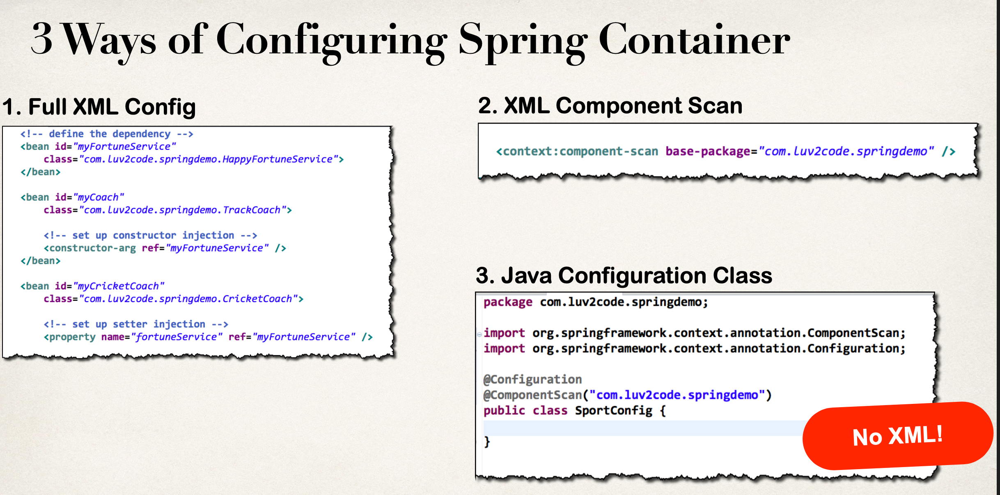
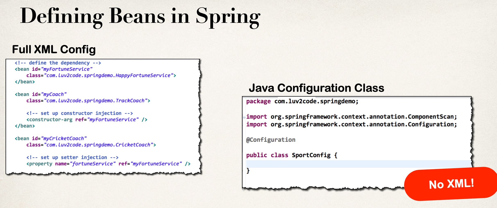
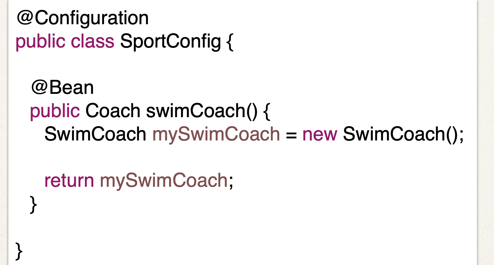
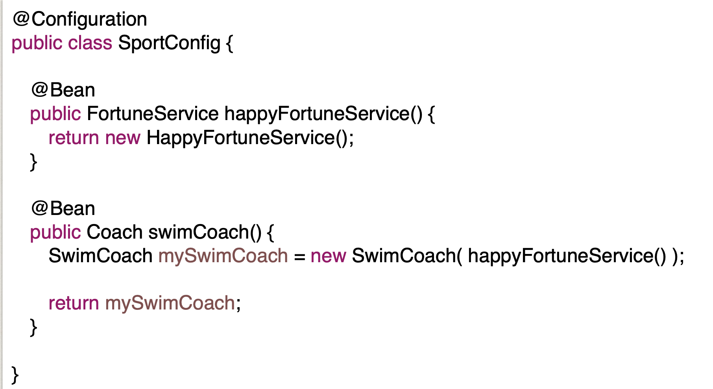
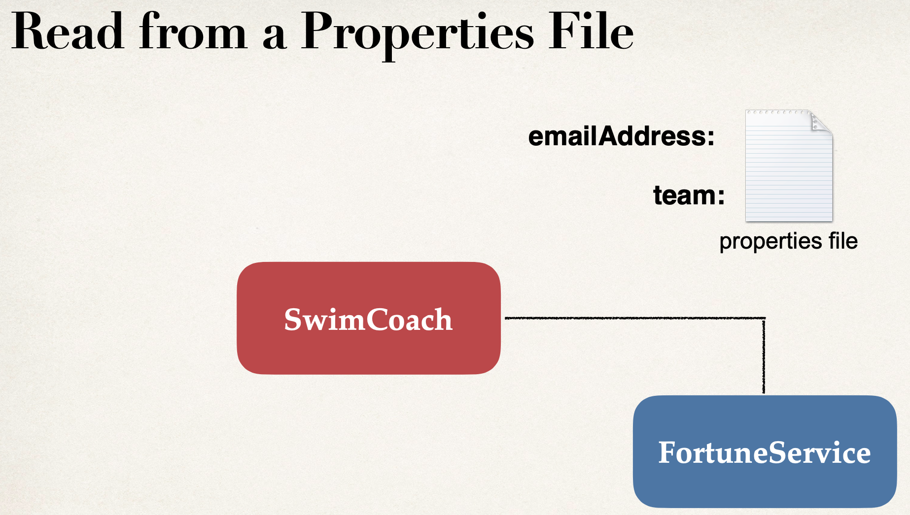
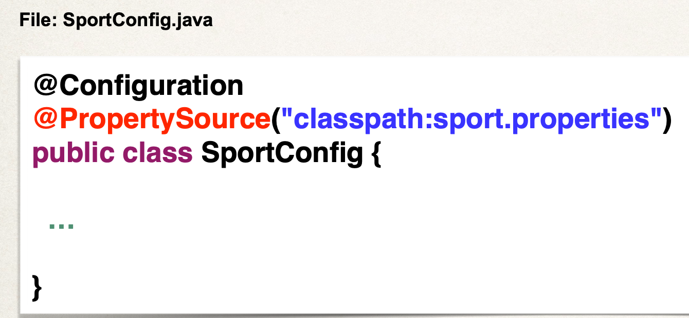
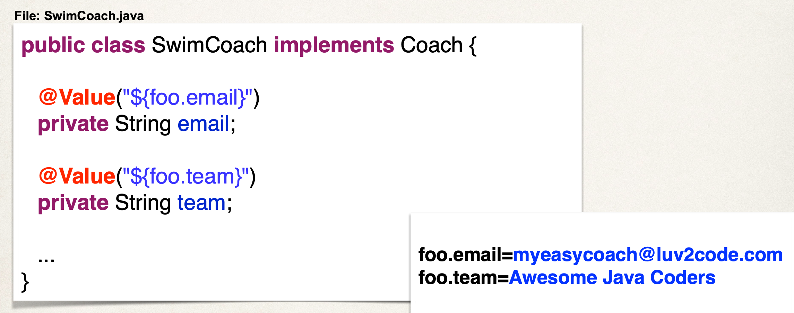

# 1. Java Configuration

* Instead of using XML, we will use pure Java Code

**RECAP: 3 ways of Configuring Spring Container**

## Development Process

1. Create a Java class and annotation as @Configuration

2. Add component scanning support: @ComponentScan (optional)

3. Read Spring Java Configuration class

4. Retrieve bean from Spring container

# 2. Defining Beans with Java Code

**RECAP::**

## 2.1 Development Process

1. Define method to expose bean

2. Select bean dependencies 

3. Read Spring Java configuration class

4. Retrieve bean from Spring container

# 2. Injecting Values from Properties file

## Development Process
1. Create Properties

2. Load Property File in Spring Config

3. Reference Values from Property File

# Good External Sources

https://www.geeksforgeeks.org/spring-configuration-annotation-with-example/
