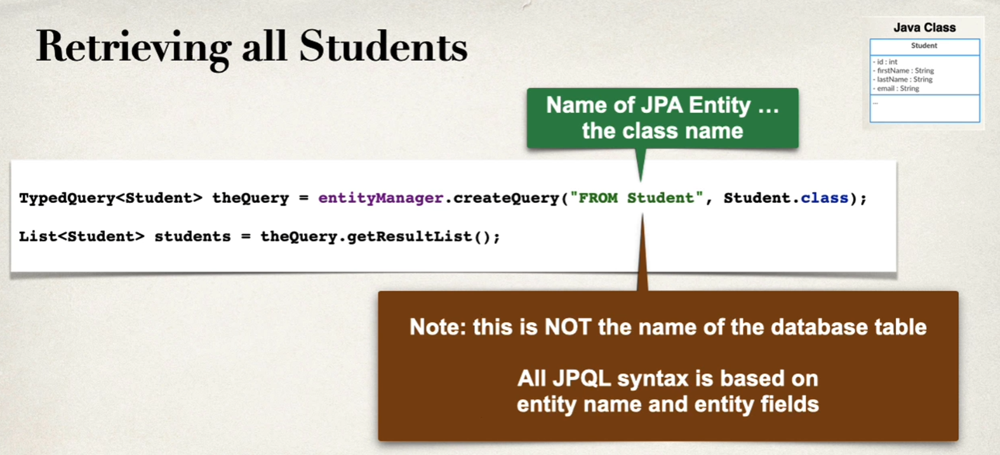
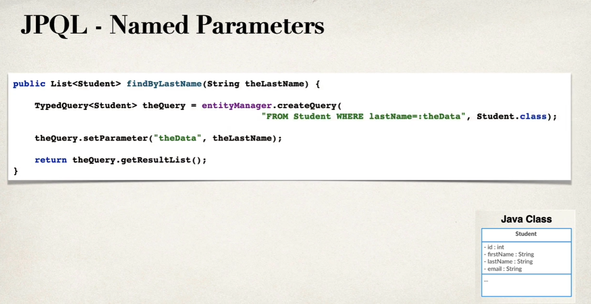
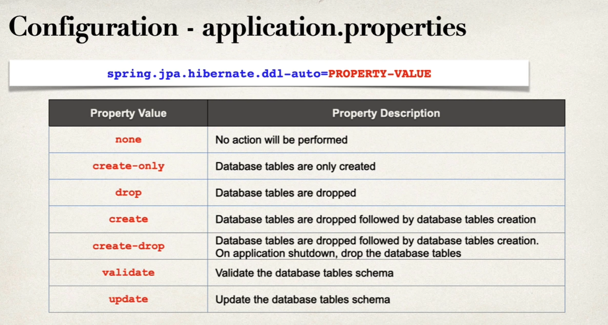
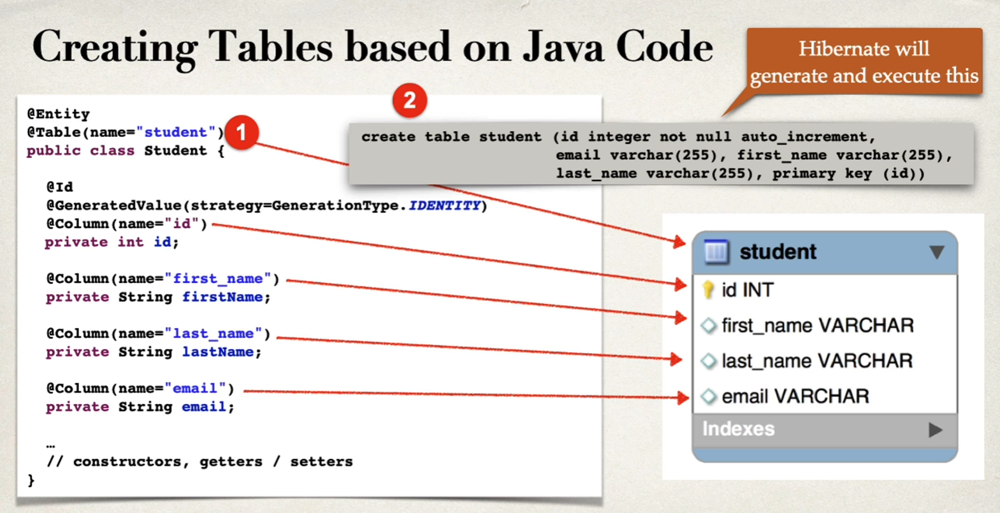

# Querying Objects with JPA

# [SKIPPED] Updating/Deleting an Object with JPA

* very simple, just following syntaxes

# Creating Database Tables from Java Code

* Create tables based on Java code with JPA/Hibernate annotations

## Configuration

* In spring boot configuration file: `application.properties`
  * `spring.jpa.hibernate.ddl-auto=XXX`
  

  * If you choose `create`, when you run your app, JPA/Hibernate will **drop** tables then **create** them (yes, all data is lost)

