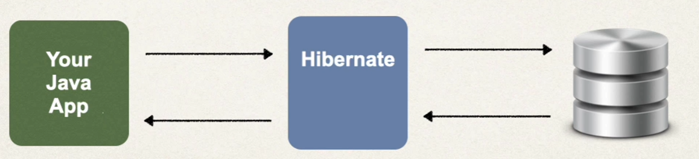
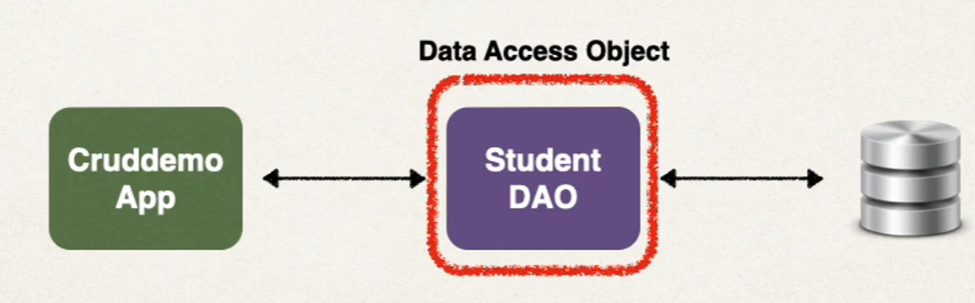
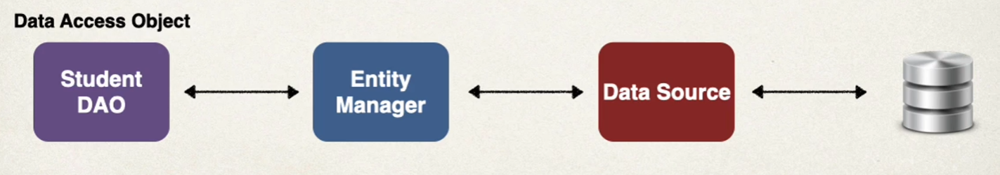
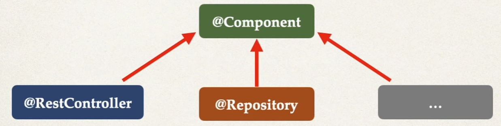

# Hibernates/JPA CRUD

## What is Hibernate?
* A framework for persisting/saving Java objects in a database
  * https://hibernate.org/orm/



* Benefits
    * Hibernates handles all the low-level SQL
    * Minimizes the amount of JDBC code you have to develop
    * Hibernate provides the Object-to-relational mapping (ORM)

* Object-to-relational Mapping
    * mapping between java class and database schema


## What is JPA?
* Jakarta Persistence API (previously known as Java Persistence API)
  * Is a standard API for Object-to-Relational Mapping (ORM)
  * Only a **specification**
    * defines a set of interfaces
    * requires an implementation to be usable

* vendor implementations
    * Hibernate
    * EclipseLink


* Benefits
    * By having a standard API, you are not locked to vendor's implementation
    * Maintain portable, flexible code by coding the JPA spec
    * Can theoretically switch vendor implementation (eg. switch between Hibernate and EclipseLink)

* Saving a Java Object with JPA
```java
Student student = new Student("Paul", "Doe", "pd@pd.com");

// save it to database
entityManager.persist(theStudennt); // entityManager is a JPA Helper Object
```

* Retrieving a Java Object with JPA

```java
Student student = new Student("Paul", "Doe", "pd@pd.com");
entityManager.persist(theStudennt);

// Retrieve from the database
int theID = 1;
Student myStudent = entityManager.find(Student.class, theID);
```

* Querying for Java Objects

```java
TypedQuery<Student> theQuery = entityManager.createQuery("from Student", Student.class);
List<Student> students = theQuery.getResultList();  // Returns a list of Student objects from the database.
```

## Relationship between JDBC and JPA
* Hibernate/JPA uses JDBC for all database communications


## Automatic Data Source Configuration

* In Spring Boot, Hibernate is the default implementation of JPA
* EntityManager is
    * main component for creating queries.etc...
    * from JPA
* Based on configs, Spring Boot will automatically create the beans: DataSource, EntityManager 

## Steps from high-level overview

* Step 1: Set up Dev Environment
    * https://dev.mysql.com/downloads/mysql/
    * https://dev.mysql.com/downloads/workbench/

* Step 2: Create database and table

```sql
CREATE DATABASE  IF NOT EXISTS `student_tracker`;
USE `student_tracker`;

--
-- Table structure for table `student`
--

DROP TABLE IF EXISTS `student`;

CREATE TABLE `student` (
  `id` int NOT NULL AUTO_INCREMENT,
  `first_name`varchar(45) DEFAULT NULL,
  `last_name` varchar(45) DEFAULT NULL,
  `email` varchar(45) DEFAULT NULL,
  PRIMARY KEY (`id`)
) ENGINE=InnoDB AUTO_INCREMENT=1 DEFAULT CHARSET=latin1;
```

* Step 3: Set up Project
    * At spring initializr (start.spring.io), Add dependencies:
        * MySql Driver: mysql-connector-j
        * Spring Data JPA: spring-boot-starter-data-j

    * Add mysql properties to application.properties
```
spring.datasource.url=jdbc:mysql://localhost:3306/student_tracker
spring.datasource.username=root
spring.datasource.password=password
```

* Step 4: Execute Maven application to check if it's running properly.

* Step 5: Annotate Java Class
* Step 6: Develop Java Code to perform database operaiton


## Entity Class
* Definition:
    * java class that is mapped to a database table

* At minimum, must:
    * be annotated with `@Entity`
    * have a public or protected no-argument constructor
        * The class can have other constructors
    * Java Basics
        * If you don't declare any constructor, you get a no-arg constructor for free
        * Howeve,r if you declare one with argument, then you DO NOT get a no-arg constructor for free

## Annotations
* Steps
    * Step 1: Map class to datatbase table
```java
@Entity
@Table(name="student") 
public class Student {
    ...
}
```
*
    * Step 2: Map fields to database columns
```java
@Entity
@Table(name="student") 
public class Student {
    // BELOW are NEW code
    @Id                 // 'primary key'
    @GeneratedValue(strategy=GenerationType.IDENTITY)   // Generate Strategy
    @Column(name="id")
    private int id;

    @Column(name="first-name")
    private String firstName
}
``` 

* ID Generate Strategy

| Name | Description |
|---|---|
| GenerationType.AUTO | Pick an appropriate strategy for the particular database |
| GenerationType.IDENTITY (generally recommended) | Assign primary keys using database identity column |
| GenerationType.SEQUENCE | Assign primary keys using database sequence |
| GenerationType.TABLE | Assign primary keys using an underlying database table to ensure uniqueness |

* 
    * you can create your own CUSTOM generation strategy; create implementing of org.hibernate.id.IdentifierGenerator; override the method: public Serializable generate(..)

* Example Code so far
```java
import jakarta.persistence.*;

@Entity
@Table(name="student")
public class Student {
    // define fields
    @Id
    @GeneratedValue(strategy = GenerationType.IDENTITY)
    @Column(name = "id")
    private int id;

    @Column(name = "first_name")
    private String firstName;

    @Column(name = "last_name")
    private String lastName;

    @Column(name = "email")
    private String email;

    // define constructors
    public Student(String firstName, String lastName, String email) {
        this.firstName = firstName;
        this.lastName = lastName;
        this.email = email;
    }

    // define getters/setters
    ...
}
```

## Data Access Object (DAO)

* DAO is a common design pattern - Responsible for interfacing with the database
* In short: 

  * Typical methods: save, findByID, findAll, findByLastName, update, delete, deleteAll.etc

### Relationship with JPA

* Note that JPA EntityManager and Data Source is automatically created by Spring Boot (Based on the file: application .properties (JDBC URL, user id, password.etc))
* We can autowire/inject the JPA Entity Manager into our student DAO



## Steps
### 1. Define DAO interface
```java
public interface StudentDAO {
    void save(Student theStudent);
}
```

### 2. Define DAO implementation
* Inject the entity manager

```java
import org.springframework.beans.factory.annotation.Autowired;

@Repository // explained below
public class StudentDAOImpl implements StudentDAO {
    private EntityManager entityManager;

    @Autowired
    public StudentDAOImpl(EntityManager theEntityManager) { // Inject the EntityManager
        entityManager = theEntityManager;
    }

    @Override
    @Transactional // explained below
    public void save(Student theStudent) {
        entityManager.persist(theStudent);
    }
}
```

#### Special Annotations
**@Transactional**
  * Automatically begin and end transaction for your JPA code
  * (from spring framework)

**@Repository**
  * Spring will automatically register the DAO implementation (thanks to component scanning)
  * provides translation of any JDBC-related exceptions
  * sub-annotation of @components



### 3. Update main app

```java
@SpringBootApplication
public class HibernateJpaDemoApplication {
	public static void main(String[] args) {
		SpringApplication.run(HibernateJpaDemoApplication.class, args);
	}

	@Bean
	public CommandLineRunner commandLineRunner(StudentDAO studentDao) {
		return runner -> {
			createStudent(studentDao);
		};
	}

	private void createStudent(StudentDAO studentDao) {
		// create the student object
		System.out.println("Creating new student object...");
		Student tmpStudent = new Student("PD", "Paul", "Doe", "paul@luv");

		// save the student object
		System.out.println("Saving the student...");
		studentDao.save(tmpStudent);

		// display id of the saved student
		System.out.println("Saved student. Generated id: " + tmpStudent.getId());
	}
}
```

### Run Main
* If you run main, and check the database, you should see a new row containing "Paul Doe".
