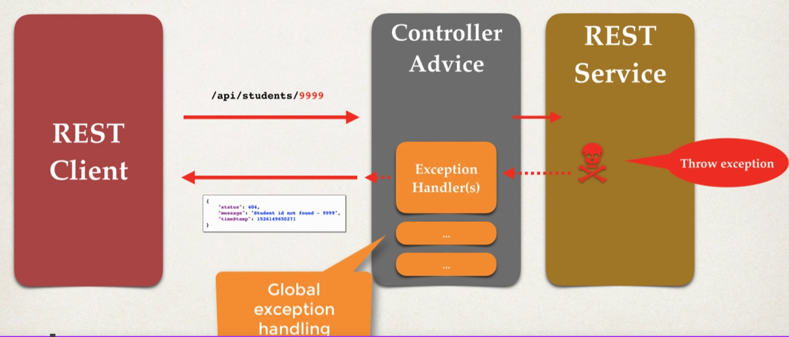
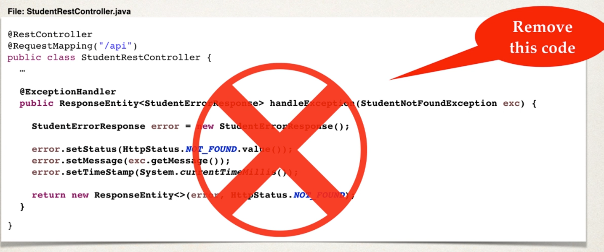

# Spring REST controller

* access to `/test/hello`
* Using below code, when you go to `localhost:8080/spring-rest-demo/test/hello` you will get "Hello World"
```
@RestController
@RequestMapping("/test")
public class DemoRestController {
    @GetMapping("/hello")
    public String sayHello() {
        return "Hello World!";
    }
}
```

## Development Process

1. Add Maven Dependency for Spring Boot Starter Web

    * File: pom.xml
    * 
```
<dependency>
    <groupId>org.springframework.boot</groupId>
    <artifactId>spring-boot-starter-web</artifactId>
</dependency>
```
*
    * (Or, at spring initializr website, select "web" dependency)

2. Create Spring REST Service using `@RestController`

# Java JSON Binding

* Data Binding is the **process of converting JSON data to a Java POJO** (or vice versa)
*   Also known as mapping, serialization/deserialization, marshaling/unmarshaling
* Spring uses **Jackson Project** behind the scenes
    * Spring Boot Starter Web automatically includes dependency for Jackson
* During the conversion, Jackson will call the `setXXX` to create the POJO (so it doesn't need to access private fields directly)
    * For example, if you have:

```
public class Student {
    private int id;

    public void setId(int id) {
        this.id = id
    }
}
``` 
*   * Jackson will actually call `setId` to create the Student POJO

* When going from POJO to JSON, Jackson will call the `getXXX` methods

## Spring and Jackson Support
* When building Spring REST applications, Spring will automatically **handle Jackson integration**
* JSON data being passed to REST controller is converted to POJO
* Java object returned from REST controller is converted to JSON
* This all happens automatically behind the scenes

# Spring Boot REST POJO (Overview)

## Create a new service

* return a list of students

## Development Process
1. Create Java POJO Class for **Student**
2. Create Spring REST service using **@RestController**

```
@RestController
@RequestMapping("/api")
public class StudentRestController {
    @GetMapping("/students")
    public List<Student> getStudents() {
        List<Student> students = new ArrayList<>();
        students.add(new Stuent("))
        return "Hello World!";
    }
}
```

# Path Variables

* GET /api/students/{studentId}
    * Here, **studentId** is known as **path variable**

## Development Process
1. Add request mapping to Spring REST Service
    * Bind path variable to method parameter using `@PathVariable`
```
@RestController
@RequestMapping("/api")
public class StudentRestController {
    @GetMapping("/students/{studentId}")                            // Set path variable
    public Student getStudent(@PathVariable int studentId) {        // Use @PathVariable here
        ...
        return theStudents.get(studentId)
    }
}
```

* Small tip: in the real world, we might want to use `@PostConstruct`
```
@RestController
@RequestMapping("/api")
public class StudentRestController {

    List<Student> theStudents

    // only run once
    @PostConstruct
    public void loadData() {
        theStudents = new ArrayList<>();
        theStudents.add(new Student(...))
    }

    @GetMapping("/students/{studentId}")                            // Set path variable
    public Student getStudent(@PathVariable int studentId) {        // Use @PathVariable here
        return theStudents.get(studentId)
    }
}
```


# Exception Handling
* Without setting exceptions, we get this if we run into below error - which is not very neat nor helpful.
```
{
    "status": 500,
    "error": "Internal Server Error"
}
```
* What we want is something like:
```
{
    "status": 404,
    "error": "student id not found - 9999"
}
```

## Development Process

1. Create a custom error response class
2. Create a custom exception class
3. Update REST service to throw exception if student not found
4. Add an exception handler method using @ExceptionHandler

### 1 - Create a custom error response class

* The custom error response class will be sent back to client as JSON. 
* We will define as Java class (POJO)
    * Jackson will handle converting it to JSON
* Example:
```
public class StudentErrorREsponse {
    private int status;
    private String message;
    private long timeStamp;

    // constructors

    // getters/setters
}
```

### 2 - Create custom student exception
* The custom student exception will used by our REST service
* In our code, if we cannot find student, then we will throw an exception
* Need to define a custom student exception class
* Example:
```
public class StudentNotFoundException extends RuntimeException {
    public StudentNotFoundException(String message) {
        super(message);
    }
}
```

### 3 - Update REST service to throw exception
```
@RestController
@RequestMapping("/api")
public class StudentRestController {

    @GetMapping("/students/{studentId}")                            
    public Student getStudent(@PathVariable int studentId) {        
        if( (studentId >= theStudents.size()) || (studentId < 0)) {
            throw new StudentNotFoundException("student id not found - " + studentId);  // Add this
        }
        return theStudents.get(studentId)
    }
}
```

### 4 - Add exception handler method
* Define exception handle method(s) with @ExceptionHandler annotation
* Exception Handler will return a ResponseEntity
* ResponseEntity is wrapper for the HTTP response object
* ResponseEntity provides fine-grained control to specify 
    * HTTP status code, HTTP headers and response body

```
@RestController
@RequestMapping("/api")
public class StudentRestController {

    @ExceptionHandler
    public ResponseEntity<StudentErrorResponse> handleException(StudentNotFoundException exc) {
        StudentErrorResponse error = new StudentErrorResponse();
        error.setStatus(HttpStatus.NOT_FOUND.value());
        error.setMessage(exc.getMessage());
        error.setTimeStamp(System.currenTimeMillis());
        
        return new ResponseEntity<>(error, HttpStatus.NOT_FOUND);
    }
}
```

# Global Exception Handling

## How this works?



* Basically, you have an extra layer called `ControllerAdvice` that will handle the exception handling logic before returning to REST client. That way, you don't need to separately define the exception handling logic in each and every controller.

## Development Process
1. Create new @ControllerAdvice
2. Refactor REST service.. remove exception handling code
3. Add exception handling code to @ControllerAdvice

### 1 - Create new @ControllerAdvice

```java
// file: StudentRestExceptionHandler.java
@ControllerAdvice
public class StudentRestExceptionHandler {
    ...
}
```

### 2 - Refactor REST service.. remove exception handling code



### 3 - Add exception handling code to @ControllerAdvice

* Literally move what you deleted from step 2, to the `StudentRestExceptionHandler` (from step 1)
