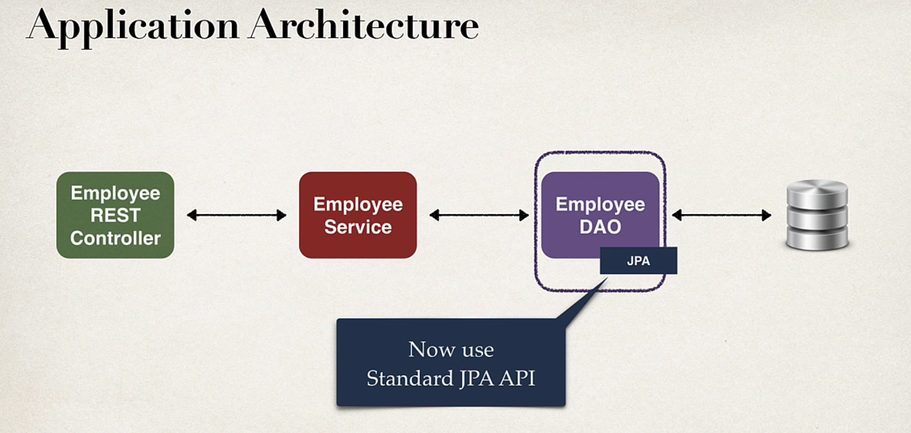

# Spring Boot REST DAO



We will focuse on The JPA API

## Development Process

1. Set up Database DEV Environment
2. Create Spring Boot Project using Spring Initializr

---- we will build a DAO layer for steps 3-7

3. Get list of employees
4. Get single employees by ID
5. Add new employee
6. Update an existing Employee
7. Delete an existing employee

\----

### Overall Idea
#### Dao Implementation

```
@Repository
public class EmployeeDAOJpaImpl implements EmployeeDAO {    // note how we keep the same dao interface to remain consistent
    private EntityManager entityManager;

    @Autowired
    public EmployeeDAOJpaImpl(EntityManager theEntityManager) { // "EntityManager" is automatically created by Spring Boot; constructor injection
        entityManager = theEntityManager;
    }
}

```

#### Get a list of employees (JPA API)
```
@Override
public List<Employee> findAll() {
    // create a query
    TypedQuery<Employee> theQuery = entityManager.createQuery("from Employee", Employee.class);

    // execute query and get result list
    List<Employee> employees = theQuery.getResultList();    // using standard JPA API

    // return the results
    return employees;
}
```


## Development Process of Creating DAO Layer

1. Update db configs in application.properties
2. Create Employee entity
3. Create DAO Interface
4. Create DAO implementation
5. Create REST controller to use DAO
