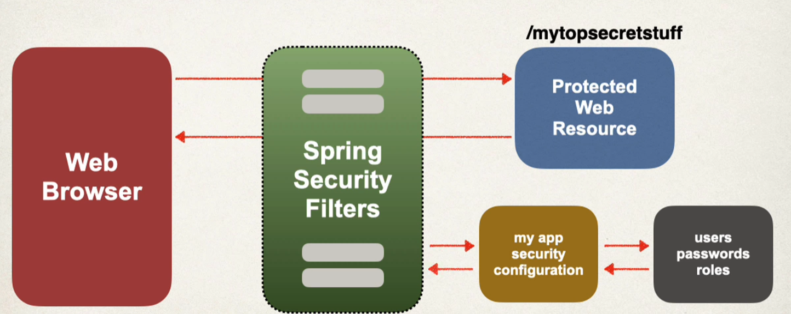

# Overview

## Spring Security Model
* Spring Security defines a framework for security
* Implemented using Servlet Filters in the background
* Two methods of securing an app: declarative and programmatic

## Spring Securitywith Servlet Filters
* Servlets Filtersare used to pre-process/post-process web requests
* Servlet Filters can route Web requests based on security logic
* Spring provides a bulk of security functionality wiht servlet filters

## Spring Security Overview



## Security concepts

* Authentication
    * Check user id and password with credentials stored in app/db
* Authorization
    * Check to see if user has an authorized role

## Declarative Security
* Define application's security constraints inconfiguration
    * All Java config: @Configuration
* Provides separation of concerns between application code and security

## Programmatic Security
* Spring Security provides an API for custom application coding
* Provides greater customizationfor specific app requirements

## Enabling Spring Security
1. Edit pom.xml and add spring-boot-starter-security
```
<dependency>
    <groupId>org.springframework.boot</groupId>
    <artifactId>spring-boot-starter-security</artifactId>
</dependency>
```

2. This will automagically secure all endpoints for application

3. Now when you access your applicatoin, spring security will promtp for login. 
    * Default username: user
    * Password: check console log for password
    * Of course, this is only for testing purposes


# Basic Configuration - Overview

### Development Process
1. Create Spring Security Configuration (@Configuration)
2. Add users, passwords and roles

#### 1. Create Spring Security Configuation
```java
// File: DemoSecurityConfig.java

import org.springframework.context.annotation.Configuration;

@Configuration
public class DemoSecurityConfig {
    // add our security configurations here 
}
```

#### Spring Security Password Storage
* In spring security, passwords are stored using a specific format
```
{id}encodedPassword
```

#### Step 2: Add users, passwords and roles
```java
@Configuration
public class DemoSecurityConfig {
    @Bean
    public InMemoryUserDetailsManager userDetailsManager() {
        UserDetails john = User.builder()
            .username("John")
            .password("{noop}test123")
            .roles("EMPLOYEE")
            .build()
        return new InMemoryUserDetailsManager(john)
    }
}