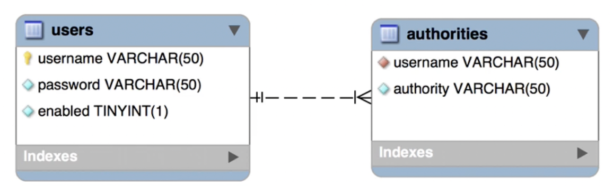
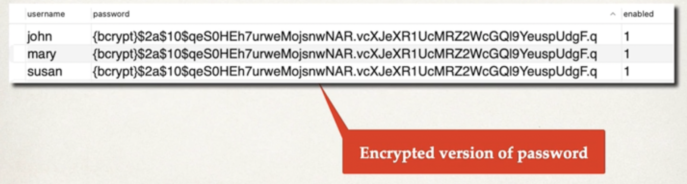
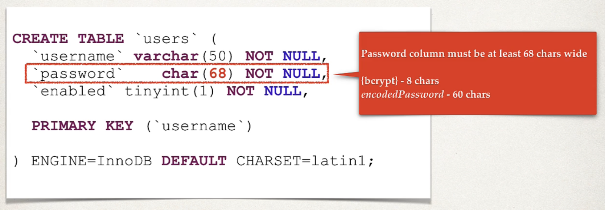
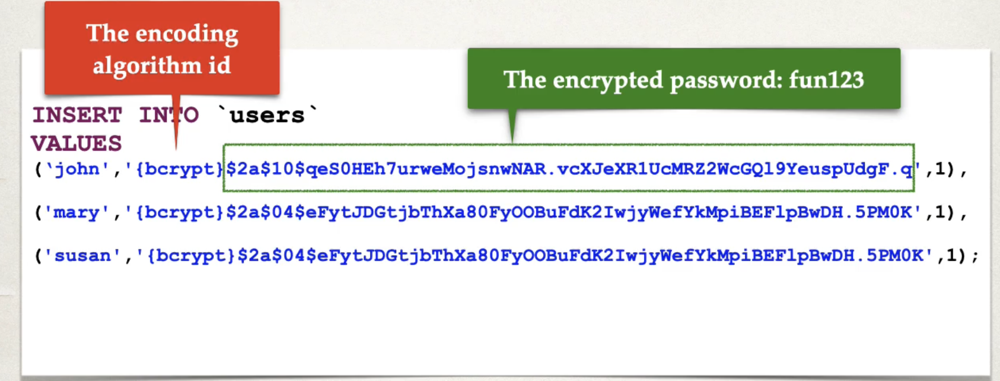
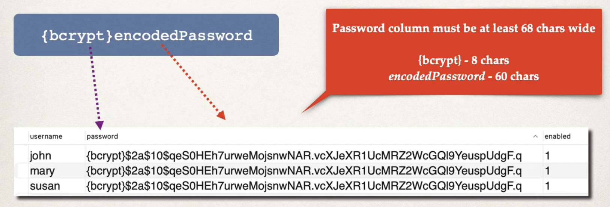
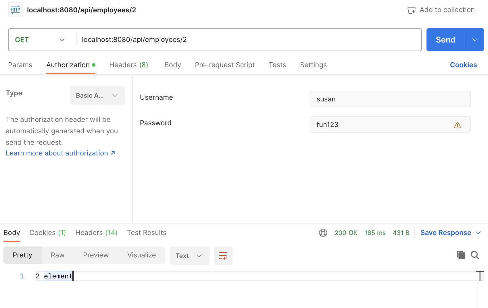
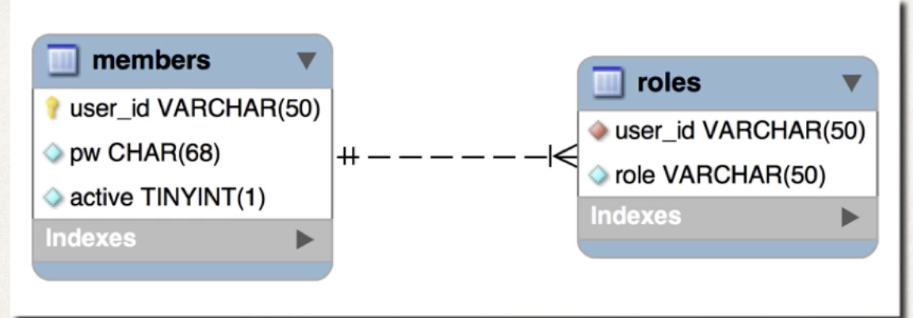

# Overview

## Spring Security Model
* Spring Security defines a framework for security
* Implemented using Servlet Filters in the background
* Two methods of securing an app: declarative and programmatic

## Spring Securitywith Servlet Filters
* Servlets Filtersare used to pre-process/post-process web requests
* Servlet Filters can route Web requests based on security logic
* Spring provides a bulk of security functionality wiht servlet filters

## Spring Security Overview


## Security concepts

* Authentication
    * Check user id and password with credentials stored in app/db
* Authorization
    * Check to see if user has an authorized role

## Declarative Security
* Define application's security constraints inconfiguration
    * All Java config: @Configuration
* Provides separation of concerns between application code and security

## Programmatic Security
* Spring Security provides an API for custom application coding
* Provides greater customizationfor specific app requirements

## Enabling Spring Security
1. Edit pom.xml and add spring-boot-starter-security
```
<dependency>
    <groupId>org.springframework.boot</groupId>
    <artifactId>spring-boot-starter-security</artifactId>
</dependency>
```

2. This will automagically secure all endpoints for application

3. Now when you access your applicatoin, spring security will promtp for login. 
    * Default username: user
    * Password: check console log for password
    * Of course, this is only for testing purposes


# Basic Configuration - Overview

### Development Process
1. Create Spring Security Configuration (@Configuration)
2. Add users, passwords and roles

#### 1. Create Spring Security Configuation
```java
// File: DemoSecurityConfig.java

import org.springframework.context.annotation.Configuration;

@Configuration
public class DemoSecurityConfig {
    // add our security configurations here 
}
```

#### Spring Security Password Storage
* In spring security, passwords are stored using a specific format
```
{id}encodedPassword
```

#### Step 2: Add users, passwords and roles
```java
@Configuration
public class DemoSecurityConfig {
    @Bean
    public InMemoryUserDetailsManager userDetailsManager() {
        UserDetails john = User.builder()
            .username("John")
            .password("{noop}test123")
            .roles("EMPLOYEE")
            .build()
        return new InMemoryUserDetailsManager(john)
    }
}
```

# Restrict URLs based on Roles

* General Syntax
```
requestMatchers(<< add path to match on >>)
    .hasRole(<< authorized role >>)
```
OR (specify HTTP method)
```
requestMatchers(<< add HTTP METHOD to match on >>, << add path to match on >>)
    .hasRole(<< authorized role >>)
```
OR (adding list of roles)
```
requestMatchers(<< add HTTP METHOD to match on >>, << add path to match on >>)
    .hasRole(<< list of authorized role >>)
```


## Cross Site Request Forgery

* Spring Security can protect against CSRF attacks
* Embded additional authentication data/token to all HTML forms
* On subsequent requests, web app will verify token before processing
* Primary use case is traditional web applications (HTML forms.etc)

### When to use CSRF Protection?
* The Spring Security team recommends:
    * The CSRF protection for any normal browser web requests
    * Traditional web apps with HTML forms to add/modify data
* If you are building a REST API for non-browser clients
    * you may want to disable CSRF protection
* In general, not required for stateless REST APIs
    * that use post, put, delete and/or patch


## Code
```
@Bean
public SecurityFilterChain filterChain(HttpSecurity http) throws Exception {
    http.authorizeHttpRequests(configurer ->
            configurer
                    .requestMatchers(HttpMethod.GET, "/api/employees").hasRole("EMPLOYEE")
                    .requestMatchers(HttpMethod.GET, "/api/employees/**").hasRole("MANAGER")
    );
    // use HTTP Basic Authentication --> since we are overriding the security filter chain, we need to specify what http authentication method we are using.
    http.httpBasic(Customizer.withDefaults());

    // disable cross site request forgery (CSRF)
    http.csrf(csrf -> csrf.disable());

    return http.build();
};
```

## Potential problem with ERROR with PUT request
* If so, https://www.udemy.com/course/spring-hibernate-tutorial/learn/lecture/42261704#overview

# JDBC Authentication - Plain Text
* Up to now, we've only hard-coded our user data. 
* Goal here is to integrate with database

## Database Support in Spring Security
* Spring Security can read user account info from database
* By default, you have to follow spring security's predefined table schemas

## Customize Database Access with Spring Security
* Can also customize the table schemas
* Useful if you have custom tables specific to your project/custom
* you will be responsible for developing the code to access the data
    * JDBC, JPA/Hibernate.etc

## Development Process
1. Develop SQL Script to set up database tables
2. Add database support to Maven POM file
3. Create JDBC properties file
4. Update Spring Security Configuration to use JDBC

### Default Spring Security Database Schema



* "authorities" is same as "roles"

### Step 1: Develop SQL script to setup database tables
```sql
CREATE TABLE `users` (
    `username` varchar(50) NOT NULL,
    `password` varchar(50) NOT NULL,
    `enabled` tinyint NOT NULL,

    PRIMARY KEY (`username`)
) ENGINE=InnoDBB DEFAUTL CHARSET=latin1

CREATE TABLE `authorities` (
    `username` varchar(50) NOT NULL,
    `authority` varchar(50) NOT NULL,

    UNIQUE KEY `authorities_idx_1` (`username`, `authority`)

    CONSTRAINT `authorities_ibfk_1`
    FOREIGN KEY (`username`)
    REFERENCES `users` (`username`)
) ENGINE=InnoDB DEFAULT CHARSET=latin1;
```

### Step 2: Add Database support to Maven POM file
* JDBC Driver
```xml
<dependency>
    <groupId>com.mysql</groupId>
    <artifactId>mysql-connector-j</artifactId>
    <scope>runtime</scope>
</dependency>
<dependency>
    <groupId>org.springframework.boot</groupId>
    <artifactId>spring-boot-starter-jdbc</artifactId>
</dependency>
```

### Step 3: create JDBC properties file
```java
#
# JDBC properties
#
spring.datasource.url=jdbc:mysql://localhost:3306/employee_directory
spring.datasource.username=springstudent
spring.datasource.password=springstudent
```

### Step 4: Update Spring Security to use JDBC
```java
// no longer hard code users, gets user data from database
@Bean
public JdbcUserDetailsManager userDetailsManager(DataSource datasource) {
    return new JdbcUserDetailsManager(datasource);
}
```

# BCrypt Encryption

* up to now, we are storing our password in plain text - not ideal for production
* The best practice is store passwords in an encrypted format


## Spring Security Team Recommendation
* Spring Security recommends using the popular bcrypt algorithm
* bcrypt
    * performs one-way encrypted hashing
    * adds a **random salt** to the password for additional protection
    * includes support to defeat brute force attacks

## How to Get a Bcrypt password?
* You have a plaintext password and you want to encrypt using bcrypt
* Option 1: Use a website utility to perform the encryption (such as this https://www.bcryptcalculator.com/)
* Option 2: Write Java Code to perform the encryption

## Development Process
1. Run SQL Script that contains encrypted passwords
    * Modify DDL for password field, length should be 68




## Password Storage
* passwords are stored using a specific format:



## Spring Security Login Process
1. Retrieve Password from db for the user
2. Read the encoding algorithm id (Bcrypt.etc)
3. For case of bcrypt, encrypt plaintext password from login form (using salt from db password)
4. Compare encrypted password from login form with encrypted password from db
5. if there is a match, login successful
6. if no match, login NOT successful

## Example (after code change)


# Spring Security Custom Tables

* Previously, we mentioned that we have to use a specific table format in the database when storing user info. This is very restrictive, and sometimes we want **custom tables**

## Development Process
1. Create our custom tables with SQL
2. Update Spring Security Configuration
    * Provide Query to find user by username
    * Provide Query to find authorities/roles by user name

### Step 1: Create our custom tables with SQL


### Step 2: Update Spring Security Configuration
```java
@Bean
public JdbcUserDetailsManager userDetailsManager(DataSource datasource) {
    JdbcUserDetailsManager manager = new JdbcUserDetailsManager(datasource);
    manager.setUsersByUsernameQuery("select user_id, pw, active from members where user_id=?");
    manager.setAuthoritiesByUsernameQuery("select user_id, role from roles where user_id=?");
    return manager;
}
```

## If you have some login issues, try setting `logging.level.org.springframework.security=DEBUG` in applications.yml


