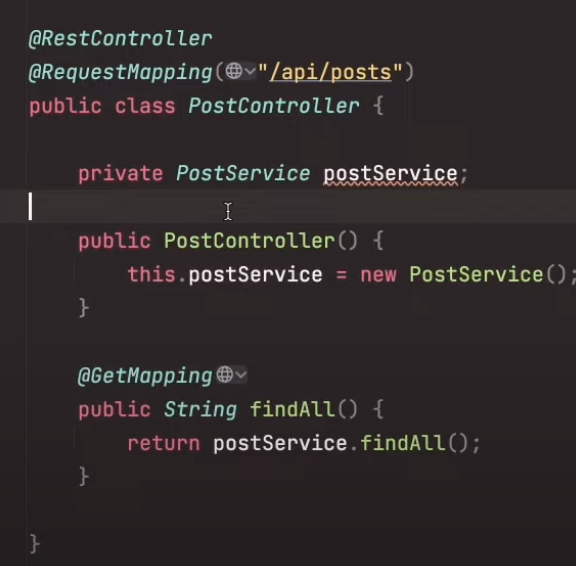
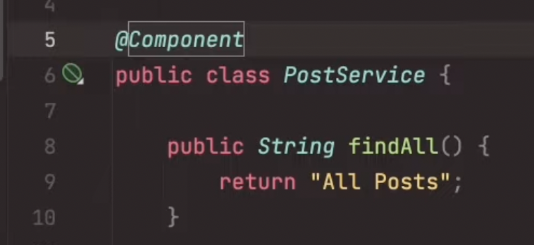
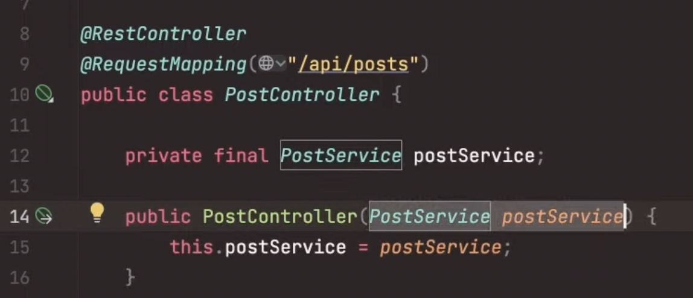

# Spring Notes

## Why use beans?

Normally, you might do something like this; use **new** to create postService.

But we actually **DON'T** want to do this. We want to leave the object creation process to be handled by spring.
(I think it's because there's a lot of code you need to generate, and also for things like singleton, it's much easier to implement.)

Instead in Spring, you can add `@Component` to your PostService class

And then, in your PostController, you can simply put `PostService postService` as arguments, and it will **AutoWire**.

